# DISMATH_ProjectBonus_SantosCellix

##DESIGN
###For Linear search
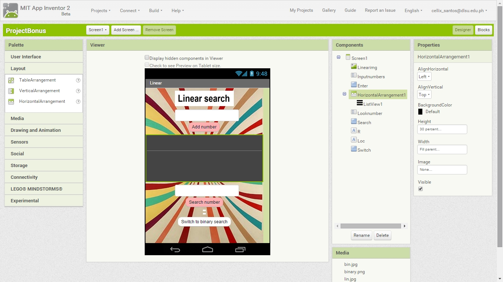
###For Binary search
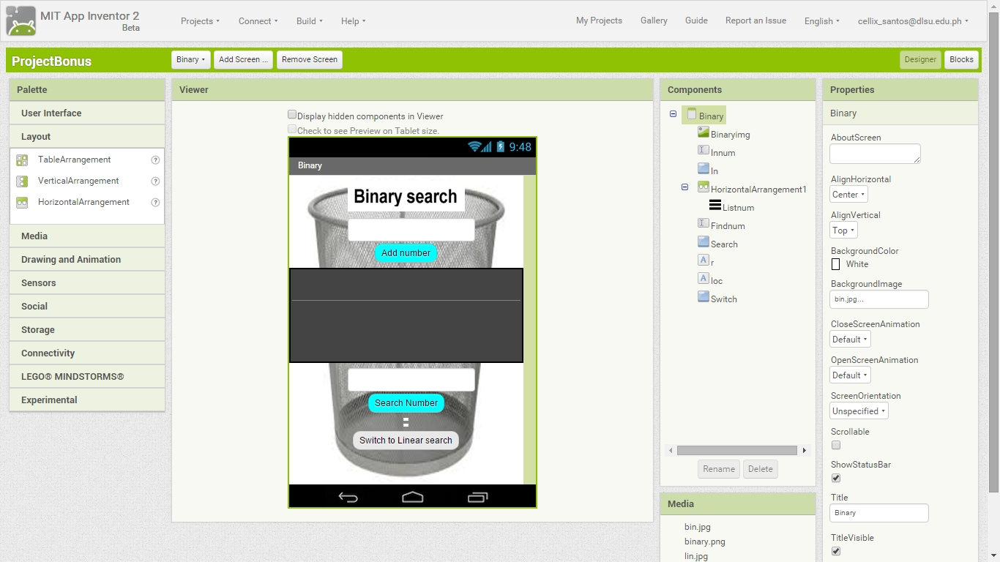
  

##BLOCKS
###For Linear search
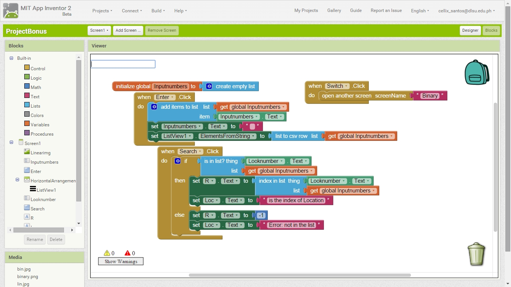
###For Binary search
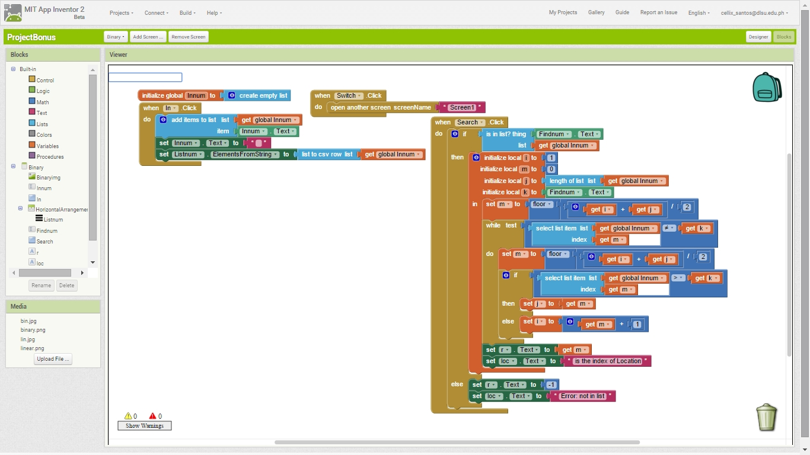
  

##Testing
###For Linear search
####Start

####Adding 6 numbers which are 1, 4, 7, 9, 11, and 13
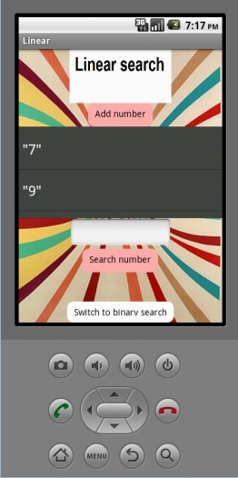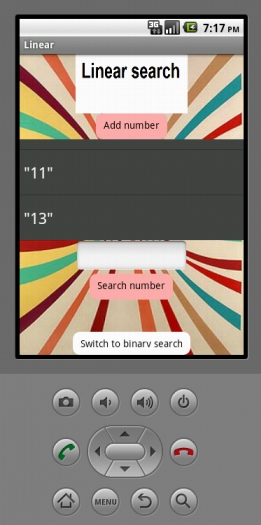
####Searching numbers in the list (1, 7, and 13)
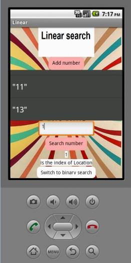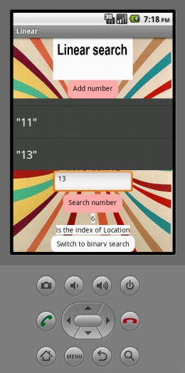
####Searching numbers which are not in the list (2, 5, 12)

###For Binary search
####Start
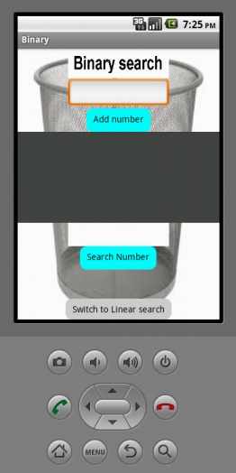
####Adding 6 numbers which are 2, 3, 7, 14, 99, and 107
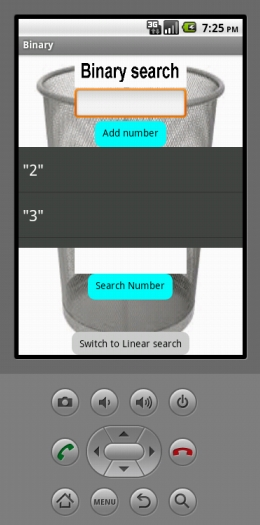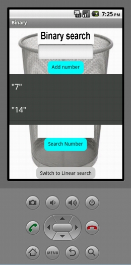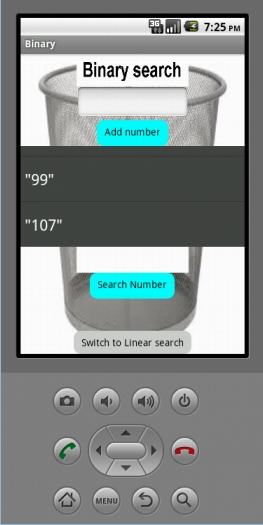
####Searching numbers in the list (3, 7, and 99)
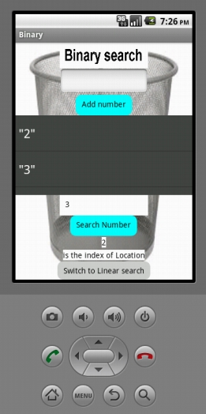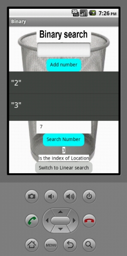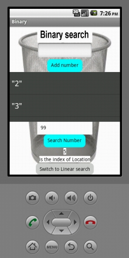
####Searching numbers which are not in the list (5, 88, 109)

